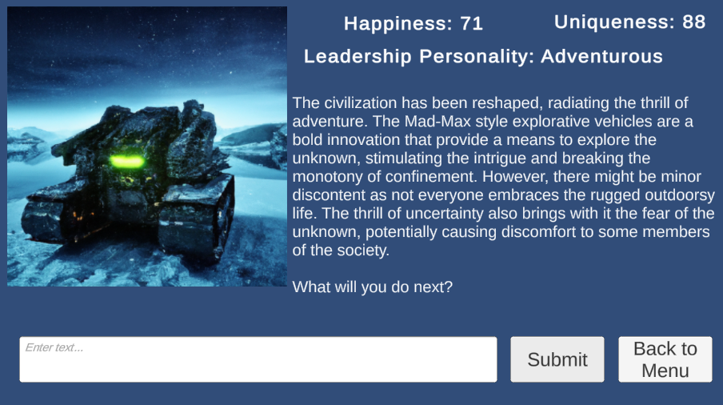

# Improbability Police

## Overview
*Improbability Police* is a game developed for a 10-day itch.io game jam with a post-apocalyptic theme. The game leverages GPT-4 for dynamic content generation and player interaction, and it was intended to be played in a web browser via itch.io. The game was completed successfully in the 10-day time-frame, but did not work as expected in the itch.io browser. However, the development process provided valuable learning experiences in GPT-4 integration, proxy servers, and AWS. Ultimately, the AWS and OpenAI api costs were too high to keep a demo active long-term, but video of the gameplay can be found at the links below.

## Game Description
In *Improbability Police*, players are tasked with building a civilization on a newly colonized planet by making decisions of what to build. The game uses GPT-4 to give updates on how the civilization is going and assess the overall happiness of the civilization, as well as the uniqueness of the player's responses.

## What I Learned
The development of *Improbability Police* provided numerous learning opportunities:
- **GPT-4 Integration:** Understanding how to integrate and utilize GPT-4 for dynamic content generation and player interaction.
- **Proxy Servers:** Setting up a Flask proxy server to securely manage API requests.
- **AWS:** Deploying and managing an AWS EC2 instance to host the Flask application, ensuring scalability and reliability.
- **WebGL and itch.io:** Building and deploying a Unity WebGL game and the challenges associated with games that require access to an external API.
- **tmux and Server Management:** Using tmux for managing long-running processes on an EC2 instance.
- **CORS and Network Configuration:** Configuring CORS and security groups to handle cross-origin requests and ensure network security.
- **Working Within a Deadline:** Managing time effectively to develop and deliver the game within the 10-day timeframe of the game jam.

## Narrative Backstory Video
- [Watch the Narrative Backstory Video](https://www.youtube.com/watch?v=IQmGUNdRSwQ)

## Gameplay Video
- Link coming soon.
